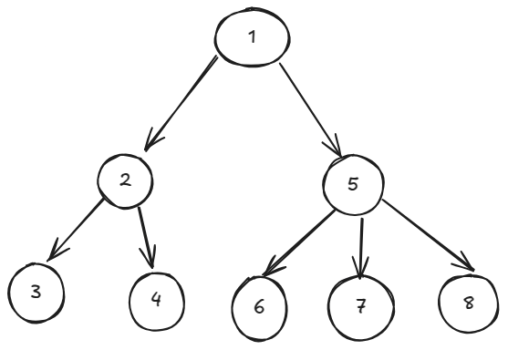

## Planeación o busquedas

Si se quiere encontrar el camino con el menor costo de un nodo a otro se utilizan *algoritmos de busqueda*.

Modelamos un grafo donde los nodos son un estado y las aristas son las acciones.

Analizamos los nodos para ver a que otros nodos podemos llegar al realizar acciones legales.

**Plan**: Secuencia de acciones

### Busqueda a lo profundo (DFS)

Clasificamos los nodos en explorados y no explorados.

Se usa una pila LIFO como *frontera* de nodos, agregamos los nodos adyacentes a la frontera y seguimos expandiendo con el último que fue agregado.

  
**Orden en el que se checan los nodos**

```
# Pseudo-código iterativo de wikipedia
# G es el grafo, v es el nodo del que se empieza
procedure DFS_iterative(G, v) is
    let S be a stack
    S.push(v)
    while S is not empty do
        v = S.pop()
        if v is not labeled as discovered then
            label v as discovered
            for all edges from v to w in G.adjacentEdges(v) do
                if w is not labeled as discovered then
                    S.push(w)
```

...

### Busqueda a lo ancho

  