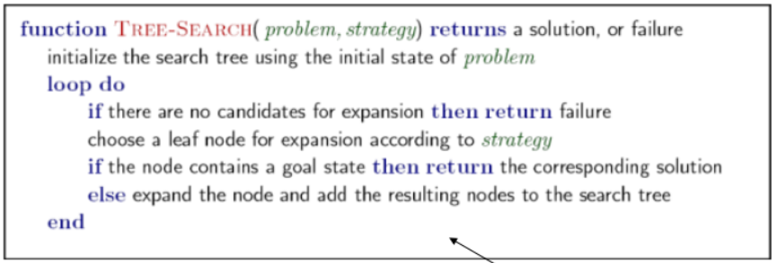
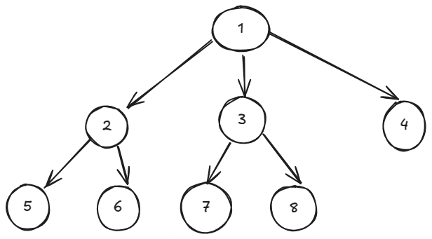

## Planeación o busquedas

Si se quiere encontrar el camino con el menor costo de un nodo a otro se utilizan *algoritmos de busqueda*.

Modelamos un grafo donde los nodos son un estado y las aristas son las acciones.

Analizamos los nodos para ver a que otros nodos podemos llegar al realizar acciones legales.

Se guarda en una *frontera* los 
nodos no explorados.

**Plan**: Secuencia de acciones

#### Algoritmo general de busqueda
  
### Depth First Search (DFS) / A lo profundo

La frontera se implementa con una **pila** (una estructura **LIFO**) y se expande checando el tope de la pila, o sea el último elemento.

  
**Orden en el que se checan los nodos**

### Breadth First Search (BFS) / A lo ancho

La frontera se implementa con una **cola** (una estructura **FIFO**) y se expande checando el elemento que lleva más tiempo en la cola.

  

### Uniform Cost Search (UCS) / Costo uniforme
La frontera se implementa con una cola de prioridad, se va expandiendo el nodo con el menor **costo**.

### Heurísticas
Una heurística es un estimado de que tan cerca está un estado de la meta, lo usamos para reducir el número de nodos que checamos.

Con UCS se checan todos los posibles planes que tienen un costo menor al plan óptimo que lleva a la meta, esto puede ser muy costoso, por eso se usa una heurística para reducir el número de estados.

Hay que tener en cuenta que con una heurística no encontramos el mejor plan, pero encontramos un plan lo suficientemente bueno con el que nos conformamos.

Una heurística es **admisible** si **h(n) <= h*(n)**, donde *h(n)* es la heurística que se estima en un nodo *n* y *h*(n)* es el costo verdadero a la meta con un plan óptimo.

### Algoritmo Greedy
La frontera se implementa con una cola de prioridad, se va expandiendo el nodo con la menor heurística.

### A*
La frontera se implementa con una cola de prioridad, se va expandiendo con la menor suma del costo y la heurística.

### Resumido
- **DFS** usa una cola y expande el **primero**
- **BFS** usa una pila y expande el **último**
- Con una cola de prioridad:
	+ **UCS** expande el que tenga menor **costo**.
	+ **Greedy** el que tenga menor **heurística**.
	+ **A***: **c(n)+h(n)**