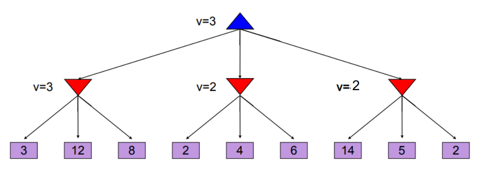
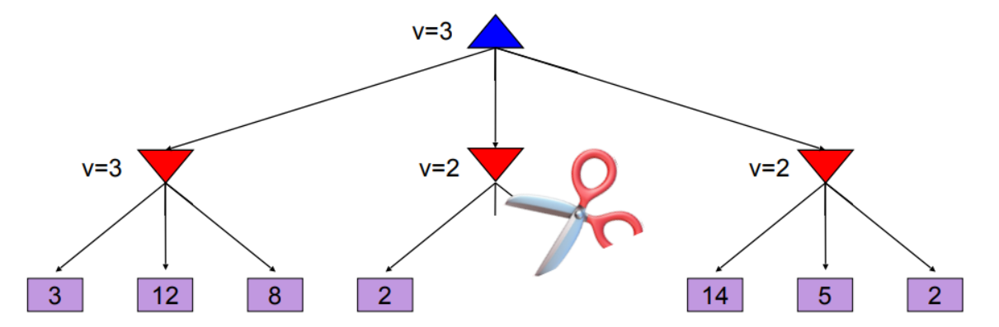

## Juegos con adversarios

### Maneras de clasificarlos

* ¿Es *determinista* o *estocástico*?
* ¿Es perfectamente observable?
* El número de jugadores (al menos 2)
* ¿Es por *equipos* o *individuales*?
* ¿Es de *suma cero*?
> **Suma cero**: la suma de las ganancias de todos los jugadores es 0, o sea que cuando alguien gana los adversarios pierden, por ejemplo ajedrez.

### Modelo
* P := 'conjunto de jugadores' 
* S := 'conjunto de estados'
* s<sub>0</sub> := 'el estado inicial', tal que s<sub>0</sub> ∈ S
* A := conjunto de acciones
* Acciones legales: S x P ⇾ P(A)
* Transición: S x A x P ⇾ S
* es_terminal: S ⇾ {TRUE, FALSE}
* Ganancia: S x P ⇾ R

### Minmax
Se asume que el rival va  a minimizar la ganancia, o sea que va a realizar la mejor acción.
```
def valor(estado, jugador):
	# estado terminal, por ejemplo jaque mate en ajedrez
	if es_terminal(estado): 
		return utilidad

	# turno del jugador 1 que busca maximizar utilidad
	if turnoj1:
		v = -∞	
		for sucesor in estado.hijos:
			v = max(v, valor(sucesor))
		return v
		
	# turno del jugador 2 que busca minimizar utilidad
	v = +∞	
	for sucesor in estado.hijos:
		v = min(v, valor(sucesor))
	return v	
```


Tiempo: $O(b^m)$  
Espacio: $O(bm)$

Hace una busqueda exaustiva por todo el árbol.

### Tree pruning
No hace falta todo el árbol, así que se aplica una *podación*.



Al checar la hoja donde está el 2 se está escogiendo un mínimo, pero como el jugador 1 va a escoger un máximo, y 2 es menor a 3, aunque se siga checando los demás nodos el jugador 2 solo va a agarrar uno que sea menor a 2, así que el máximo de dicho número y el 3 va a seguir siendo 3.  

dado $x<2$  
$max(3, min(2, x))$ = 3

A esto se le llama **Alpha-Beta Pruning**,

```
# pseudo-código estilo python basado en la presentación
def max-valor(estado, α, β):
	if es_terminal(estado):
		return estado.ganancia
	v = -∞
	for sucesor in estado.sucesores:
		v = max(v, min-valor(sucesor, α, β))
		# podación
		if v ≥ β return v
		α = max(α, v)
	return v

def min-valor(estado , α, β):
	if es_terminal(estado):
		return estado.ganancia
	v = +∞
	for sucesor in estado.sucesores:
		v = min(v, max-valor(successor, α, β))
		# podación
		if v ≤ α return v
		β = min(β, v)
	return v
```