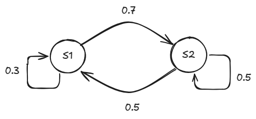

## Procesos de decisión de Markov

MDP = \<S, A, $A_l$, T, r, $S_t$, $\gamma$>

* S es el conjunto de estados.
* $A$ es el conjunto de acciones.
* $A_l$: S$\rightarrow \wp$(A), las acciones legales.
* T: S$\times A\times$S$\rightarrow R$, probabilidad de una transición.
* r: S$\times A\times$S$\rightarrow R$, recompensa de una transición.
* S$_F \subseteq$ S, conjunto de estados terminales.
* $0\leq \gamma \leq 1$, factor de descuento

Dado un $X_t$ que es un MDP (Markov decision process) de *primer orden*, el estado en un tiempo dado solo depende del estado en el tiempo anterior.

Ejemplo de un modelo MDP:  
  

$p_{ij} = Pr(X_{t+1} = S_i | X_t = S_j)$  
$p_{ij}$ es la probabilidad de ir a el estado $S_i$ desde el estado $S_j$.

La *matriz de probabilidad* del ejemplo es:  

P = $\begin{array}{|c c|}
		0.3 & 0.5\\
		0.7 & 0.5
	\end{array}$
	
Dado $P(X_0)$, un vector con las probabilidades de estar en cada estado en el tiempo inicial:  
$P(X_{t+1}) = PP(X_t)$  
$P(X_t) = P^tP(X_0)$   

Si el MDP es *estacionario* entonces en un tiempo lo suficientemente grande:  
$P(X_{t+1}) = P(X_t)$

### Políticas
Una política $\pi$ *determinista* indica que acción tomar en cada estado.  
$\Pi:S\rightarrow A$

$R_t =\sum_{i=0}^\infty (\gamma^ir_{t+i})$, es la **recompensa** teniendo en cuenta las recompensas futuras.

> Si $\gamma= 0$ en este contexto $0^0 = 1$.

$\pi^*$ es la política que maximiza la esperanza de $R_t$, se considera la mejor política.

$V^{\pi}(S)$ se usa para comparar políticas, donde:  

* $\pi_1 \geq \pi_2 \iff V^{\pi_1}(S) \geq V^{\pi_2}(S) ~\forall s \in S$ 

* $V^{\pi}(S) = E[R_t | S_t = s] = \sum_{s'\in\Omega}T(s,\pi(s),s')[r(s,\pi(s),s')+\gamma V^{\pi}(s')]$

* $V^{\pi^*}(S)\equiv V^*(S)$