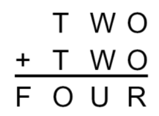
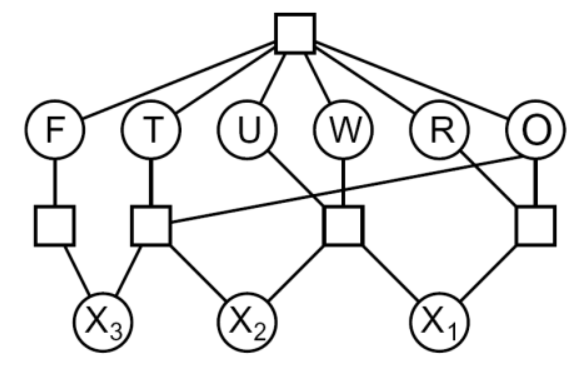

## Problemas de satisfacción de restricciones 

Se modela un problema de satisfacción de restricciones como como un problema de busqueda, donde se busca darle una posible asignación a unas **variables**, las cuales pueden tomar valores de sus respectivos **dominios**, tal que se satisfagan las **restricciones** del problema.

* **Variables** $X=\{X_1, X_2, ...\}$
* **Dominios** $D=\{D_1, D_2, ...\}$
* **Restricción** $r: X^n \rightarrow \{True, False\}$

Una restricción se clasifica según el número de variables que involucra:

* **Unaria**: n = 1
* **Binaria**: n = 2
* **Global**: n > 2

> Toda restricción global se puede transformar en restricciones binarias.

### Ejemplo

* X = {T, W, O, F, U, R}
* D = {$D_i ~|~ i \in [1,6] \land D_i \in [0,9]~ \forall i$}

Restricciones:

* (2 * O) // 10 = R
* (2 * W + (2 * O) % 10) // 10 = U
* (2 * T + (2 * W + (2 * O) % 10) % 10) // 10 = O
* (2 * T + (2 * W + (2 * O) % 10) % 10) % 10 = F

Estas restricciones globales se pueden convertir a restricciones binarias de alguna manera:

Al tener un CSP donde todas las restricciones son binarias se puede representar graficamente con un **grafo de restricciones**.

___

X es un **espacio métrico** iff

$\exists d: X \times X \rightarrow R$ tal que:

* $d(x,x) = 0 ~\forall x \in X$
* $d(x,y) = d(y,x) ~\forall x,y \in X$
* $d(x,y)^2 + d(y,z)^2 \leq d(x,z)^2 ~\forall x,y,z \in X$

X es un **espacio topológico** iff:

$v\equiv vecinos$  
$\exists~v: X\rightarrow \wp(X)$ tal que

* $x\notin v(x) ~\forall x\in X$