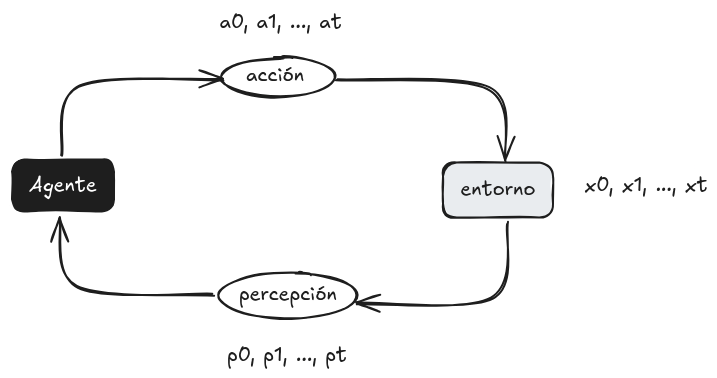

## Notas del 13 al 17 de enero

La ***inteligencia artificial*** es el desarrollo de ***agentes racionales.***  

Se plantea un ***entorno***, el cual tiene un cierto *estado*, el ***agente*** busca maximizar la ***utilidad*** con las ***acciones*** que este puede hacer decidiendo en base a su ***percepción*** del entorno.  

> A cada instante en el tiempo se le asigna un estado, acción y percepción.

### Ejemplo

Como ejemplo de juguete, se tiene un robot roomba limpia suelos encargado de limpiar 2 cuartos:

* El **Agente** es el robot.

* Dado X1={s,l}, X2={s,l} y X3={A,B}, donde:
	* X1 representa si el primer cuarto
	 está sucio o limpio.
	* X2 representa si el segundo cuarto está sucio 		 o limpio.
	* X3 representa en que cuarto está el robot.   
	El producto cartesiano de estos *subespacios* es el 
	conjunto de todos los posibles **estados** del entorno.
	
* Las **acciones** del robot pueden ser moverse de cuarto, limpiar el cuarto en el que se está o no hacer nada.

* Las **percepciones** del agente pueden ser en que cuarto se encuentra el agente (¿a lo mejor no necesario?) y si el cuarto en el que se encuentra está sucio o limpio.

* La **utilidad** podría ser siempre mantener los cuartos limpios, o a lo mejor también podría depender además de la energía usada y que trate de minimizar que tanto se mueve o limpia.

### Características el entorno

* ***Discreto / continuo***  
  Un entorno es **discreto** cuando los *subespacios* son discretos, como en el ejemplo de juguete.   
Un entorno es **continuo** cuando los subespacios son continuos, por ejemplo con números reales.
> No estoy seguro como definir subespacio.

* ***Estático / Dinámico***  
  Un entorno es **estático** cuando el estado del entorno depende solo de las acciones del agente, en otro caso es **Dinámico**.

* ***Observable / Parcialmente Observable***  
* ***Determinista / Estocástico***  
* ***Conocido / Desconocido***
* ***Un agente / Multiagente***
* ***Episódico / Secuencial***

### 