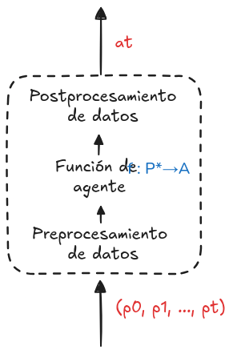

## Notas del 13 al 17 de enero

La ***inteligencia artificial*** es el desarrollo de ***agentes racionales.***  

Se plantea un ***entorno***, el cual tiene un cierto *estado*, el ***agente*** busca maximizar la ***utilidad*** con las ***acciones*** que este puede hacer decidiendo en base a su ***percepción*** del entorno.  

> A cada instante en el tiempo se le asigna un estado, acción y percepción.

### Ejemplo

Como ejemplo de juguete, se tiene un robot roomba limpia suelos encargado de limpiar 2 cuartos:

* El **Agente** es el robot.

* Dado X1={s,l}, X2={s,l} y X3={A,B}, donde:
	* X1 representa si el primer cuarto
	 está sucio o limpio.
	* X2 representa si el segundo cuarto está sucio 		 o limpio.
	* X3 representa en que cuarto está el robot.   
	El producto cartesiano de estos *subespacios* es el 
	conjunto de todos los posibles **estados** del entorno.
	
* Las **acciones** del robot pueden ser moverse de cuarto, limpiar el cuarto en el que se está o no hacer nada.

* Las **percepciones** del agente pueden ser en que cuarto se encuentra el agente (¿a lo mejor no necesario?) y si el cuarto en el que se encuentra está sucio o limpio.

* La **utilidad** podría ser siempre mantener los cuartos limpios, o a lo mejor también podría depender además de la energía usada y que trate de minimizar que tanto se mueve o limpia.

### Características el entorno

* ***Discreto / continuo***  
  Un entorno es **discreto** cuando los *subespacios* son discretos, como en el ejemplo de juguete.   
Un entorno es **continuo** cuando los subespacios son continuos, por ejemplo con números reales.

* ***Estático / Dinámico***  
Si el entorno puede cambiar cuando un agente está tomando una decisión entonces el entorno es **dinámico** para dicho agente, en otro caso si el agente se puede tomar todo el tiempo del mundo es **estático**. 

>Cuando el transcurso del tiempo no cambia el entorno pero si la utilidad del agente entonces se le llama *semidinámico*.

  Un entorno es **estático** cuando el estado del entorno depende solo de las acciones del agente, en otro caso es **Dinámico**.

* ***Observable / Parcialmente Observable***  
Un entorno es **observable** cuando el agente tiene acceso completo al estado del entorno en todo momento, si no se tiene acceso se le llama *inobservable*, en otro caso es **parcialmente observable**.

* ***Determinista / Estocástico***  
  Un entorno es **determinista** cuando el estado del entorno depende solo de las acciones del agente y el estado del entorno, en otro caso es **estocástico**. 
 > Cabe mencionar que hay casos en los que se puede preferir hacer un modelo estocástico aunque éste sea determinista por que es menos trabajoso o por ignorancia.

* ***Conocido / Desconocido***  
Un entorno es **conocido** cuando el agente sabe las consecuencias o posibles consecuencias de realizar una acción, en otro caso es **desconocido**.

* ***Un agente / Multiagente***  
Cuando se involucran más de un agente se le llama **multiagente**, si es solo uno es de **un agente**.

* ***Episódico / Secuencial***  
Un entorno **episódico** se divide en episodios, en cada episodio el agente recibe una percepción y realiza una acción, las acciones de un episodio no dependen de las acciones anteriores.  
Por otro lado en un entorno **secuencial** las acciones pueden afectar acciones futuras.

### Función de agente

Un agente recibe como entrada **percepciones**, hasta un cierto tiempo, y devuelve como salida una **acción**.

> En la práctica el preprocesamiento y postprocesamiento de datos es lo más tardado.

