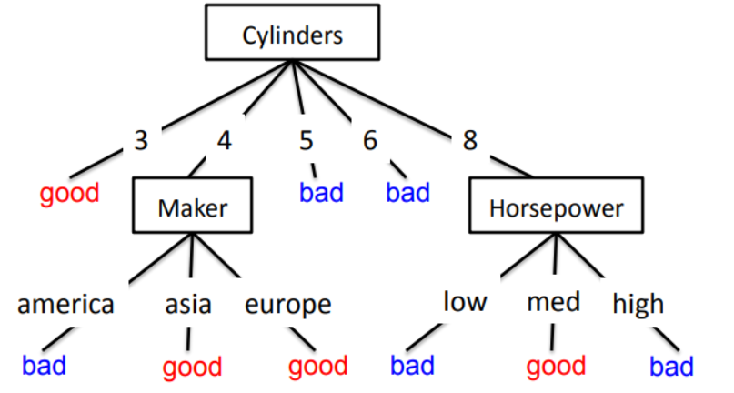

## Notas del 20 al 24 de enero

### Aprendizaje máquina (machine learning)

Desconocemos si existe una función perfecta f: X -> Y.  
Asumimos que existe y hacemos un programa para que haga el programa.  

Tenemos una muestra de datos con distribución desconocida.  

Un error que es una variable aleatoria de distribución desconocida.

Ein:  
Error en la muestra.
 
Eout:  
Error ...

función h.  

Hay aprendizaje cuando:
* Ein(h) approx 0
* Ein(h) approx Eout(h)

Mejorar la confianza a cambio de aumentar el error.  

f approx h iff Eout(h) approx 0

Función de crecimiento  

Dimensión VC, es el número de parámetros.  
Se necesita 10 veces la dimensión VC para asegurar que haya aprendizaje.

## Arboles de decisión
Explican los datos segun sus atributos.

### Entropía

Indica que tan desordenada está una variable aleatoria.

### Entropía condicional

Entropía de la variable Y condicionada con la variable X.

Usamos la entropía para decidir con que atributo dividir el árbol en un nodo de manera que esté menos desordenado.  

### Ganancia de información
Es que tanto disminuye la entropía después de dividir el arbol, elegimos un atributo con el cual dividir el árbol buscando maximizar la ganancia de información.